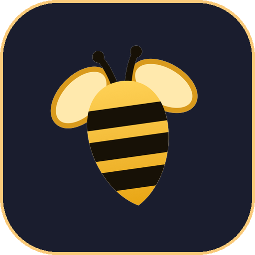

# Swarm Code

The coding app by Soumya Chakraborty. A native macOS app for your coding agents. Written entirely in Swift and SwiftUI with Liquid Glass, for Macs with Apple silicon on macOS 26 and later.

It drives the coding agents you already have installed and signed in, on your own subscriptions:

| Provider | Command line tool | Protocol |
| --- | --- | --- |
| Codex | `codex` | app-server JSON-RPC |
| Claude | `claude` | stream-json with permission prompts |
| Cursor | `cursor-agent` | Agent Client Protocol |
| OpenCode | `opencode` | Agent Client Protocol |
| Grok | `grok` | Agent Client Protocol |
| Antigravity | `agy` | stream-json headless |
| Copilot | `copilot` | headless JSON-RPC (the Copilot SDK protocol) |
| Command Code | `cmd` | headless print mode (NDJSON events), one run per turn, with a session mod for approvals |
| Pi | `pi` | RPC mode (JSONL over stdio), one process per thread, with a gate extension for approvals |
| DeepSeek | `DEEPSEEK_API_KEY` | native API (OpenAI-compatible) |
| Z.ai | `ZAI_API_KEY` | native API (OpenAI-compatible, GLM Coding Plan) |
| Meta | `MODEL_API_KEY` | native API at `api.meta.ai/v1` (Muse Spark) |

## What it does

- Projects and threads in a glass sidebar with search, pinning, settling (or archiving), and drag to resize. A settled thread drops to the bottom, small and grey, until you reopen it.
- Streaming conversations with reasoning, tool calls, plans, to-do lists and errors.
- Approvals and questions from the agent, answered inline.
- Plan mode, model and reasoning selection, and four permission modes per thread.
- Twenty-six tinted-glass themes, from System to Catppuccin, Dracula, Claude and Codex.
- A diff for every turn, captured as hidden git checkpoints, with revert.
- An embedded terminal per thread, plus project scripts from `swarm-code.json`.
- New threads in their own git worktree.
- Commit, push and pull requests, with generated commit messages and thread titles.
- A command palette, keyboard shortcuts and notifications when work finishes.
- Hydra: one chat, many heads. Switch it on and the agent leads a team of helper agents on big jobs: it writes the briefs, sends the heads out in parallel, each in its own copy of the project, and their work lands back in your checkout as one merge. Each head has a floating panel, and a pair sets the lead's model and the heads' model; a pair can cross providers, a strong lead on one and quick heads on another, with one effort slider fused for both.
- Model Context Protocol (MCP) server integration with custom MCP server manager in Settings, local proxy, OAuth authentication, and a catalog of 30+ preconfigured tools.
- Token spend tracking & Hydra metrics: live token usage and per-turn expenditure logs across providers.
- A welcome tour on first launch, six pages of real captures; the Help menu opens it again.
- Usage limits and credits: the ring beside the send button opens a popover with the context window, each plan's rolling limits and resets (Codex, Claude, Antigravity, Copilot, Command Code and Z.ai) and the credit left on DeepSeek and Command Code keys; a pair across two providers stacks the lead's over the heads'. A switch in General settings keeps the same in a floating panel beside the chat, and Settings › Providers shows every signed-in account at once. A Codex account that has banked resets can spend one from the same popover to clear its active windows.

## Requirements

- A Mac with Apple silicon running macOS 26 or later
- At least one provider installed and signed in, for example `codex login`, `claude auth login`, `copilot login`, `cmd login` or `pi` (then `/login`)
- Git, plus `gh` or `glab` for pull requests

## Build

```bash
brew install xcodegen
xcodegen generate
open SwarmCode.xcodeproj
```

SwiftTerm, the only dependency, is fetched by Swift Package Manager. Xcode asks once to trust its build plugin.

## Release

`scripts/release.sh` archives an Apple silicon build, signs it with Developer ID, notarizes and staples both the app and a disk image, and checks Gatekeeper. The disk image lands in `build.noindex/`, a folder Spotlight skips.

`scripts/publish_release.sh` then publishes the built release to GitHub (`soumyachk101/Swarm-Code-Release`).

## Layout

The sources sit in four layers with a one-way rule: Core reaches into nothing else, Services and UI reach only into Core, and App reaches into everything.

| Folder | Contents |
| --- | --- |
| `SwarmCode/Core` | Models and pure support: projects and threads, timelines, providers (`ProviderKind` lives here), Hydra, shortcuts, process I/O, JSON-RPC and the login shell. Depends on nothing else in the app. |
| `SwarmCode/Services` | Git, worktrees and diff parsing, the on-disk store, and the Codex, Claude, ACP, Antigravity, Copilot, Command Code, Pi, DeepSeek, Meta and Z.ai adapters behind one event model. Depends on Core. |
| `SwarmCode/UI` | Window chrome, common controls, Markdown rendering, the theme and the chimes. Depends on Core only. |
| `SwarmCode/App` | The app entry, commands and settings, the project library, the per-thread runtime, windows, captures and every feature view: sidebar, chat, composer, changes, terminal, palette, settings, usage and the tour. Depends on all of the above. |
| `SwarmCode_tauri` | Cross-platform Tauri desktop port (Rust + Svelte 5). |
| `SwarmCode_Mobile` | Mobile companion application (Svelte 5 + Tauri). |
| `mobile-bridge` | Local pairing bridge service for mobile companion connectivity. |
| `website` | The marketing site, published at [swarmcode.vercel.app](https://swarmcode.vercel.app). |

## Made by Soumya Chakraborty

<a href="https://github.com/soumyachk101"></a>

Swarm Code is made by [Soumya Chakraborty](https://github.com/soumyachk101) for Mac.

Website: [swarmcode.vercel.app](https://swarmcode.vercel.app)

## Acknowledgements

Swarm Code began as a native Swift rewrite of [T3 Code](https://github.com/pingdotgg/t3code) by T3 Tools Inc., under the MIT License, in T3 Code's own repository; this repository's history carries their work, and the license keeps their notice. The terminal is [SwiftTerm](https://github.com/migueldeicaza/SwiftTerm) by Miguel de Icaza, MIT License. The working indicators, the gradient pulse beside a reply and the mini pulse on working threads, along with their rotating words, are ported from [Zeron](https://github.com/zeronsh/zeron) by Wing, under the MIT License. Spending a Codex account's banked resets from the usage popover follows [MonoCode](https://github.com/hardbeat920/monocode) by hardbeat920, under the MIT License. The Copilot provider icon is the `copilot` mark from GitHub's [Octicons](https://github.com/primer/octicons), under the MIT License. See [THIRD_PARTY_NOTICES.md](THIRD_PARTY_NOTICES.md); the app carries the same notices under Settings › About › Licenses.

## License

MIT. See [LICENSE](LICENSE). The code is free to use; the name "Swarm Code" and its icons are not part of the license, see [TRADEMARK.md](TRADEMARK.md).
