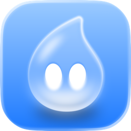

# Droppy Code

The coding app by [Droppy](https://getdroppy.app). A native macOS app for your coding agents. Written entirely in Swift and SwiftUI with Liquid Glass, for Macs with Apple silicon on macOS 26 and later.

It drives the coding agents you already have installed and signed in, on your own subscriptions:

| Provider | Command line tool | Protocol |
| --- | --- | --- |
| Codex | `codex` | app-server JSON-RPC |
| Claude | `claude` | stream-json with permission prompts |
| Cursor | `cursor-agent` | Agent Client Protocol |
| OpenCode | `opencode` | Agent Client Protocol |
| Grok | `grok` | Agent Client Protocol |
| Antigravity | `agy` | stream-json headless |
| Copilot | `copilot` | headless JSON-RPC (the Copilot SDK protocol) |
| DeepSeek | `DEEPSEEK_API_KEY` | native API (OpenAI-compatible) |
| Meta | `MODEL_API_KEY` | native API at `api.meta.ai/v1` (Muse Spark) |

## What it does

- Projects and threads in a glass sidebar with search, pinning, settling (or archiving), and drag to resize. A settled thread drops to the bottom, small and grey, until you reopen it.
- Streaming conversations with reasoning, tool calls, plans, to-do lists and errors.
- Approvals and questions from the agent, answered inline.
- Plan mode, model and reasoning selection, and four permission modes per thread.
- Twenty-six tinted-glass themes, from System to Catppuccin, Dracula, Claude and Codex.
- A diff for every turn, captured as hidden git checkpoints, with revert.
- An embedded terminal per thread, plus project scripts from `droppy-code.json`.
- New threads in their own git worktree.
- Commit, push and pull requests, with generated commit messages and thread titles.
- A command palette, keyboard shortcuts and notifications when work finishes.
- Hydra: one chat, many heads. Switch it on and the agent leads a team of helper agents on big jobs, each in a floating panel, on the model and effort you pair it with.

Remote access, mobile apps, cloud sync, telemetry and a web client are left out on purpose.

## Requirements

- A Mac with Apple silicon running macOS 26 or later
- At least one provider installed and signed in, for example `codex login`, `claude auth login` or `copilot login`
- Git, plus `gh` or `glab` for pull requests

## Build

```bash
brew install xcodegen
xcodegen generate
open DroppyCode.xcodeproj
```

SwiftTerm, the only dependency, is fetched by Swift Package Manager. Xcode asks once to trust its build plugin.

## Release

`scripts/release.sh` archives an Apple silicon build, signs it with Developer ID, notarizes and staples both the app and a disk image, and checks Gatekeeper. The disk image lands in `build.noindex/`, a folder Spotlight skips.

## Layout

| Folder | Contents |
| --- | --- |
| `DroppyCode/App` | App entry, commands, settings and the project library |
| `DroppyCode/Providers` | Codex, Claude, ACP, Antigravity and Copilot adapters behind one event model |
| `DroppyCode/Runtime` | Per-thread state, streaming, checkpoints and rewind |
| `DroppyCode/Git` | Git, worktrees, checkpoints and diff parsing |
| `DroppyCode/Views` | Window chrome, sidebar, timeline, composer, changes, terminal, palette and settings |
| `DroppyCode/Support` | Process I/O, JSON-RPC and the login shell environment |
| `website` | The marketing site, a static page published by Netlify (`netlify.toml`) |

## Made by Droppy

<a href="https://getdroppy.app"></a>

Droppy Code is made by [Droppy](https://getdroppy.app) for Mac. Find Droppy at [getdroppy.app](https://getdroppy.app).

## Acknowledgements

Droppy Code began as a native Swift rewrite of [T3 Code](https://github.com/pingdotgg/t3code) by T3 Tools Inc., under the MIT License, in T3 Code's own repository; this repository's history carries their work, and the license keeps their notice. The terminal is [SwiftTerm](https://github.com/migueldeicaza/SwiftTerm) by Miguel de Icaza, MIT License. The working indicators, the gradient pulse beside a reply and the mini pulse on working threads, along with their rotating words, are ported from [Zeron](https://github.com/zeronsh/zeron) by Wing, under the MIT License. The Copilot provider icon is the `copilot` mark from GitHub's [Octicons](https://github.com/primer/octicons), under the MIT License. See [THIRD_PARTY_NOTICES.md](THIRD_PARTY_NOTICES.md); the app carries the same notices under Settings › About › Licenses.

## License

MIT. See [LICENSE](LICENSE). The code is free to use; the names "Droppy" and "Droppy Code" and their icons are not part of the license, see [TRADEMARK.md](TRADEMARK.md).
