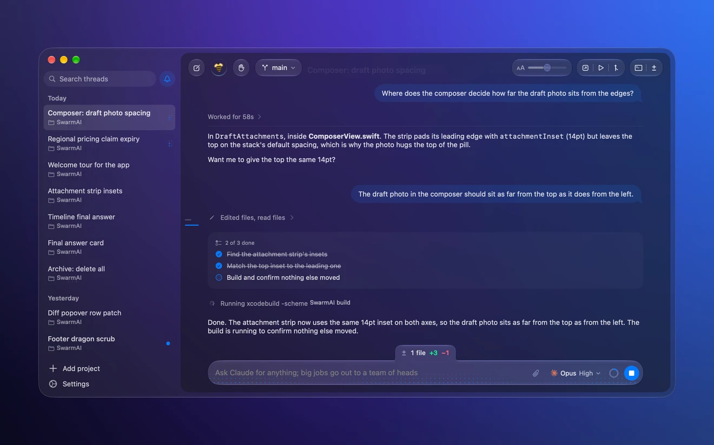
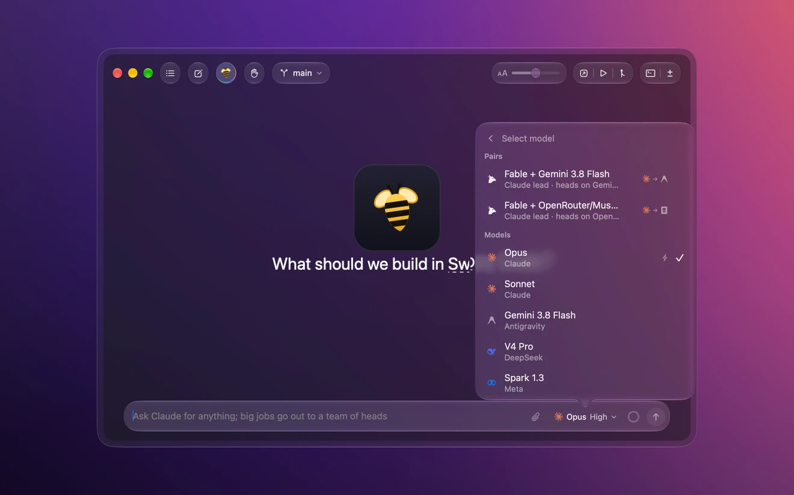
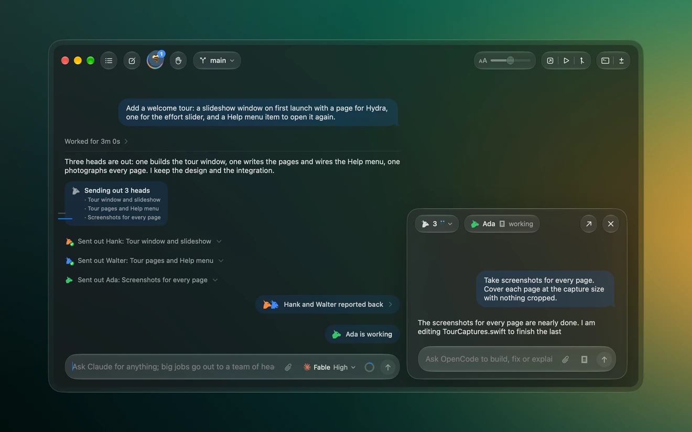
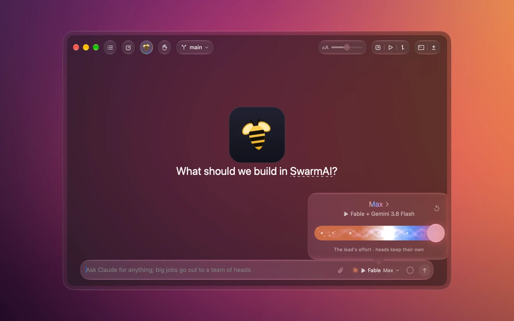

# SwarmAI

### Your coding agents. Native on the Mac.

<p align="center">
  <a href="#-download"></a>
  <a href="#-download"></a>
  <a href="#-download"></a>
  <a href="#-download"></a>
  <a href="#-download"></a>
</p>

<p align="center">
  <b>Codex</b> &bull; <b>Claude</b> &bull; <b>Cursor</b> &bull; <b>OpenCode</b> &bull; <b>Grok</b> &bull; <b>Antigravity</b> &bull; <b>DeepSeek</b> &bull; <b>Meta</b> — one Liquid Glass window.
</p>

---

## What is SwarmAI?

**SwarmAI** is a native macOS app that brings all your coding agents into one beautiful, unified window.

No Electron. No web view. No accounts. No cloud. Just you, your Mac, and the agents you already pay for — running at full speed in a Liquid Glass interface built with Swift and SwiftUI.

> Built by [Soumya Chakraborty](https://github.com/soumyachk101).

---

## Screenshots

|  |  |
|---|---|
| <br><i>Streaming replies with live diff</i> | <br><i>Hydra: one chat, many heads</i> |
| <br><i>Command palette — everything one keystroke away</i> | <br><i>26 tinted-glass themes</i> |

---

## Features

### Agents



**8 providers, one window.**
Drive Codex, Claude, Cursor, OpenCode, Grok, Antigravity, DeepSeek and Meta from the same interface. Switch mid-chat, no context lost.

### Streaming & Diffs



**Every turn, a checkpoint.**
Watch streaming replies arrive in real time. Each turn gets a diff — read, revert, or rewind any change.

### Hydra



**One chat, many heads.**
Delegate big jobs across parallel agents in separate worktrees. The lead writes briefs, heads work in parallel, changes land back in your checkout.

### Native Mac


**Built for macOS. Only macOS.**
Liquid Glass, native menus, keyboard shortcuts, window tabs. Written entirely in Swift and SwiftUI. One dependency: SwiftTerm.

<br clear="right">

### What else?

- **Follow-up queuing** — type while the agent works; follow-ups fire automatically when the turn ends
- **Inline approvals** — the agent asks before it pushes, you approve right in the chat
- **Reasoning slider** — turn the thinking up from Fast to Maximum
- **Model picker with search** — find any model across all providers instantly
- **Git built in** — worktrees, commits, pushes, pull requests
- **Terminal per thread** — a real PTY terminal in every conversation
- **26 themes** — System, Catppuccin, Dracula, Tokyo Night, Nord, Gruvbox and more
- **Zero telemetry** — no analytics, no accounts, no cloud sync

---

## Tech Stack

| Layer | Technology |
|-------|-----------|
| Language | Swift 6 |
| UI Framework | SwiftUI |
| Design | Liquid Glass |
| Terminal | SwiftTerm |
| Git | libgit2 (via Swift) |
| Architecture | MV + async/await |
| License | MIT |

**One dependency. Zero telemetry. 100% native.**

---

## Architecture

```
+------------------------------------------------------+
|              SwarmAI (SwiftUI)                        |
|  +------------------------------------------------+  |
|  |  Liquid Glass Window                           |  |
|  |  +----------+ +----------+ +----------------+  |  |
|  |  | Sidebar  | |  Chat    | |  Detail Panel  |  |  |
|  |  | Threads  | | Thread   | |  Heads / Git   |  |  |
|  |  +----------+ +----------+ +----------------+  |  |
|  |  +------------------------------------------+  |  |
|  |  | Terminal (SwiftTerm)                      |  |  |
|  |  +------------------------------------------+  |  |
|  +------------------------------------------------+  |
|  +------------------------------------------------+  |
|  |  Binary Field + Canvas                         |  |
|  |  Theme Engine (26 glass themes)                 |  |
|  |  Hydra Engine (parallel worktrees)              |  |
|  +------------------------------------------------+  |
+------------------------------------------------------+
       |                      |
       v                      v
+--------------+    +--------------+
| Your Mac     |    | Your Agents  |
| Swift/SwiftUI|    | Codex CLI    |
| No Electron  |    | Claude CLI   |
| No web view  |    | Cursor CLI   |
| 1 dep only   |    | DeepSeek     |
| Open source  |    | Meta / etc   |
+--------------+    +--------------+
```

---

## Download

<div align="center">

### Latest Release — macOS (Apple Silicon)

<a href="https://github.com/soumyachk101/SwarmAI-Release/releases/latest">
  
</a>

</div>

### Requirements

- Apple Silicon Mac (M1 / M2 / M3 / M4 or newer)
- macOS 26 or later
- At least one agent installed (e.g. `codex login` or `claude auth login`)
- Git, plus `gh` or `glab` for pull requests

### Installation

1. Download `SwarmAI-1.1.2.dmg` from the [Releases](https://github.com/soumyachk101/SwarmAI-Release/releases) page.
2. Double-click the `.dmg` file to open it.
3. Drag **SwarmAI.app** into your `/Applications` folder.
4. Launch SwarmAI from Applications or Spotlight.

> If macOS Gatekeeper shows a notice on first launch, right-click SwarmAI.app &rarr; **Open**, or run:
> ```bash
> xattr -cr /Applications/SwarmAI.app
> ```

---

## Changelog

See [`CHANGELOG.md`](CHANGELOG.md) for the full release history.

### v1.1.2

- Model search and provider switching in running chats
- Eliminated all remaining compiler warnings
- Performance improvements and bug fixes

### v1.0.0

- 8 agent providers in one window
- Hydra: parallel agents in separate worktrees
- 26 tinted-glass themes
- Streaming replies with live diff per turn
- Inline approvals and follow-up queuing
- Reasoning slider (Fast to Maximum)
- Built-in terminal per thread
- Zero telemetry, MIT licensed

---

## FAQ

### Is it really free?

Yes. SwarmAI is free and released under the [MIT License](LICENSE). You pay your agent providers as you already do; SwarmAI never sits in between, never proxies a request and never adds a markup.

### Is it open source?

Yes, all of it. The full Swift and SwiftUI source is on [GitHub](https://github.com/soumyachk101/SwarmAI-Release), with every release and its notes on the [releases page](https://github.com/soumyachk101/SwarmAI-Release/releases). Read it, build it in Xcode, or open an issue. The code is MIT; the SwarmAI name and icon are trademarks — see [TRADEMARK.md](TRADEMARK.md).

### Do I need an API key?

Not for Codex, Claude, Cursor, OpenCode, Grok or Antigravity: sign in once in your terminal, for example `codex login` or `claude auth login`, and SwarmAI uses that session and your subscription. DeepSeek and Meta talk to their APIs directly, so those two take a key, stored in your Keychain.

### Which Mac do I need?

A Mac with Apple silicon running macOS 26 or later. The app is built on Liquid Glass and ships as an Apple silicon binary only. It is signed with a Developer ID and notarized, so it opens without any Gatekeeper workaround.

### Does it send anything anywhere?

Only what your agents send to their own providers. SwarmAI has no telemetry, no analytics, no account and no cloud sync. Your threads, checkpoints and settings stay on your Mac.

### Where do I get help?

Open an issue on the [GitHub repo](https://github.com/soumyachk101/SwarmAI-Release), or email [hi@getswarmai.app](mailto:hi@getswarmai.app).

---

## License

Copyright (c) 2026 Soumya Chakraborty. All rights reserved.

SwarmAI is released under the [MIT License](LICENSE). The SwarmAI name and icon are trademarks of Soumya Chakraborty — see [TRADEMARK.md](TRADEMARK.md).

---

<div align="center">

**Made with 💙 by [Soumya Chakraborty](https://github.com/soumyachk101)**

Built in Swift and SwiftUI. For Mac, only Mac, forever.

[⬆ Back to top](#-swarmai)

</div>
