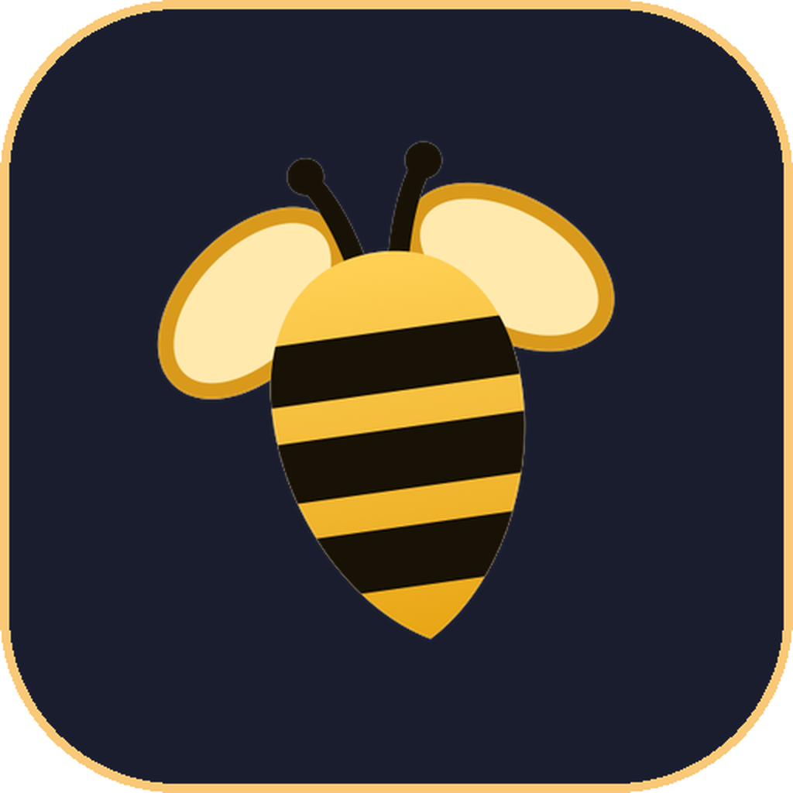
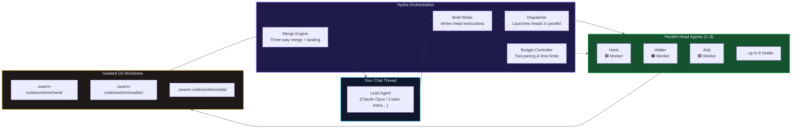

<div align="center">



# Swarm Code

### Your coding agents. Native on the Mac.

<p>
  <b>Codex</b> · <b>Claude</b> · <b>Cursor</b> · <b>OpenCode</b> · <b>Grok</b> · <b>Antigravity</b> · <b>DeepSeek</b> · <b>Meta</b>
</p>

<p>
  <a href="https://github.com/soumyachk101/Swarm-Code-Release/releases/latest"></a>
  <a href="https://github.com/soumyachk101/Swarm-Code"></a>
  <a href="LICENSE"></a>
  <a href="https://github.com/soumyachk101/Swarm-Code"></a>
</p>

<p align="center">
  <i>One Liquid Glass window. Your subscriptions. No middleman. No cloud. No compromise.</i>
</p>

</div>

---

## What is Swarm Code?

**Swarm Code** is a native macOS desktop application that unifies AI coding agents into one powerful, beautiful interface.

Built entirely in **Swift and SwiftUI** with Apple's **Liquid Glass** design language, Swarm Code drives the coding agents you already have — on your own subscriptions, with zero markup, zero cloud, zero compromise.

> **Built by [Soumya Chakraborty](https://github.com/soumyachk101). For Mac, only Mac, forever.**

---

## Architecture

### System Overview

Swarm Code is a dual-implementation platform with a native macOS frontend and a cross-platform desktop port:

<details>
<summary><b>Native macOS App — Swift/SwiftUI</b></summary>

The primary product. A single Xcode target built with Swift 6, SwiftUI, and the Liquid Glass design language. Uses only one external dependency: SwiftTerm for terminal emulation.

**Key characteristics:**
- 100% native SwiftUI with AppKit windowing
- Hardened runtime, signed and notarized
- Apple silicon (arm64) only, macOS 26+
- Four-layer architecture (Core → Services/UI → App)
- Zero telemetry, zero cloud sync, zero analytics
- Direct process spawning for CLI agents (Claude, Codex, Cursor, etc.)
- macOS Keychain for API key storage

</details>

<details>
<summary><b>Cross-Platform Desktop — Electron/Tauri + TypeScript</b></summary>

A parallel implementation using modern web technologies for broader platform reach:

- **Frontend:** React 19, Svelte 5, TanStack Router, Tailwind CSS v4
- **Backend:** Node.js 22+, Effect-TS for structured concurrency
- **Shell:** Electron 44 for desktop packaging (DMG, EXE, MSI, AppImage)
- **Monorepo:** pnpm workspaces with 10+ internal packages
- **Rust sidecar:** Native resource monitoring via sysinfo

</details>

### Application Architecture (Four-Layer Model)

The SwiftUI app follows a strict dependency hierarchy enforced by folder convention:

```mermaid
graph TB
    subgraph Layer4["App Layer — Entry, Runtime, Views"]
        direction TB
        A1[SwarmCodeApp.swift<br/>@main entry point]
        A2[AppModel.swift<br/>Central observable state]
        A3[ThreadRuntime.swift<br/>Per-thread execution]
        A4[WindowManager.swift<br/>NSWindow lifecycle]
        A5[Views/<br/>Chat · Composer · Diff<br/>Palette · Settings · Sidebar]
    end

    subgraph Layer3["UI Layer — Chrome, Markdown, Theme, Sound"]
        direction TB
        U1[Chrome/<br/>Window chrome, panels]
        U2[Markdown/<br/>Streaming renderer]
        U3[Theme/<br/>26 tinted-glass themes]
        U4[Sound/<br/>Chimes, tone synth]
    end

    subgraph Layer2["Services Layer — Git, Store, Providers, MCP"]
        direction TB
        S1[Git/<br/>DiffParser, WorkingTreeWatch]
        S2[Store/<br/>JSON persistence]
        S3[Providers/<br/>9+ adapters<br/>Claude, Codex, Cursor…]
        S4[MCP/<br/>Hub, Proxy, Bridge]
    end

    subgraph Layer1["Core Layer — Pure Models & Support"]
        direction TB
        C1[Models/<br/>Hydra, Provider, Library<br/>MCP, Timeline, Requests]
        C2[Support/<br/>Shell, JSON-RPC<br/>ObservedValue, Stdio]
    end

    A1 --> A2
    A2 --> A3
    A3 --> S3
    A3 --> S1
    A5 --> U2
    A5 --> U1

    S3 --> C1
    S2 --> C2
    S1 --> C2
    S4 --> C1

    U3 --> C1
    U2 --> C1
    U4 --> C1

    style Layer4 fill:#1a2030,stroke:#4f9cff,stroke-width:2px,color:#e8edf5
    style Layer3 fill:#1e2740,stroke:#818cf8,stroke-width:1.5px,color:#e8edf5
    style Layer2 fill:#222d45,stroke:#c084fc,stroke-width:1.5px,color:#e8edf5
    style Layer1 fill:#2a3550,stroke:#f472b6,stroke-width:1.5px,color:#e8edf5

    class A1,A2,A3,A4,A5 appStyle
    class U1,U2,U3,U4 uiStyle
    class S1,S2,S3,S4 svcStyle
    class C1,C2 coreStyle
```

**Dependency rule:** Core depends on nothing. Services and UI depend only on Core. App depends on all layers. This keeps the domain model pure and testable.

### Hydra Multi-Agent System

Hydra is Swarm Code's defining feature — parallel agent delegation with isolated worktrees:



**How it works:**

1. **Lead** agent receives your task and writes briefs for each head
2. **Dispatcher** launches up to 8 heads in parallel, each in its own git worktree
3. **Heads** execute independently — different models, different providers, different effort levels
4. **Merge Engine** lands their work back as a single merge in your checkout
5. **Budget Controller** paces tool calls (24 pacing → 120 wrap-up → 160 hard stop) and enforces a 35-minute time limit

**Head types:**
- **Native heads:** Run inside the lead's session (Claude's Agent tool, Codex's `spawn_agent`, Copilot's task tool)
- **Swarm-run heads:** Separate sessions launched by Swarm Code, typically when heads use a different provider than the lead

### Provider Ecosystem

Swarm Code abstracts 10+ AI providers behind a unified protocol:

| Provider | Protocol | Auth | Key Feature |
|----------|----------|------|-------------|
| **Claude** (Anthropic) | stream-json + permission prompts | Terminal session | Native agent tools, reasoning effort |
| **Codex** (OpenAI) | App-server JSON-RPC | Terminal session | Banked resets, async task tracking |
| **Cursor** | Agent Client Protocol (ACP) | Terminal session | Plans, todos, permission requests |
| **OpenCode** | Agent Client Protocol (ACP) | Terminal session | Resume cursor versioning |
| **Grok** (xAI) | Agent Client Protocol (ACP) | Terminal session | ACP-based subagents |
| **Antigravity** (Google) | stream-json headless | Terminal session | Sign-in flow, subagent tools |
| **Copilot** (GitHub) | headless JSON-RPC | Terminal session | Custom agents, SDK protocol |
| **Command Code** | NDJSON events + session mod | Terminal session | One run per turn, approval gate |
| **Pi** (Inflection) | JSONL over stdio | Terminal session | Gate extension for approvals |
| **DeepSeek** | Native API (OpenAI-compatible) | API key (Keychain) | Pay-as-you-go credits |
| **Meta** | Native API (Muse Spark) | API key (Keychain) | Direct API at api.meta.ai/v1 |
| **** | Native API ( Coding Plan) | API key (Keychain) | OpenAI-compatible |

### Data Flow: Request to Response

```
User Input
    │
    ▼
ComposerView → PromptEditor → ProviderSession
    │
    ▼
ThreadRuntime → ProviderAdapter (Claude/Codex/Cursor…)
    │
    ├──► Native agent tools (Claude Agent, Codex spawn_agent…)
    │         │
    │         ▼
    │    ProviderEvent.messageDelta / toolStarted / agentFinished
    │         │
    │         ▼
    │    TimelineRow (live streaming)
    │
    └──► Hydra delegation block
              │
              ▼
         HydraDelegationStreamParser
              │
              ▼
         Swarm-run heads (parallel worktrees)
              │
              ▼
         HydraMergeRecord → patch → checkout
```

### MCP Integration

Swarm Code includes a full Model Context Protocol hub:

```
MCPStore (app-wide connection manager)
    │
    ├──► Local stdio servers (MCPHub)
    ├──► Remote SSE servers
    ├──► OAuth flows (MCPProxy)
    └──► Provider injection (MCPBridgeSource)
              │
              ▼
         Each provider session receives connected MCP servers
              │
              ▼
         MCP tools appear in the agent's tool namespace
```

**30+ preconfigured tools** across Developer, Browser, Search, Work, Data, Cloud, and Knowledge categories.

### Build & Release Pipeline

```
Source → xcodegen → Xcode project → xcodebuild (Debug)
    │
    ├──► scripts/quick_run.sh → /Applications/Swarm Code Dev.app
    │
    └──► scripts/release.sh
              │
              ├── Archive + sign (Developer ID)
              ├── Notarize + staple
              ├── Package DMG (stylized with background + .DS_Store)
              └──► build.noindex/Swarm-Code-<version>.dmg
                        │
                        ▼
                   scripts/publish_release.sh
                        │
                        ├──► Tag + push to GitLab
                        └──► GitHub Release on soumyachk101/Swarm-Code-Release
                                  │
                                  ▼
                             Website update (changelog.json + version badge)
                                  │
                                  ▼
                             Vercel auto-deploy → swarmcode.vercel.app
```

---

## Features

### Multi-Agent Orchestration

- **Hydra parallel execution** — Lead agent delegates to up to 8 heads in parallel
- **Cross-provider pairs** — Claude lead with Gemini heads, Codex lead with Terra heads
- **Named head profiles** — Purpose-built configurations (quick, deep, visual)
- **Hydra Cookbook** — 9 curated pair recipes with effort presets
- **25 named head personas** — Hank, Walter, Ada, Otto, Nova, Remy, and more
- **Git worktree isolation** — Each head works in its own copy of the project
- **Automatic merging** — Heads' work lands as one merge with conflict handling
- **Live model switching** — Change provider/model mid-chat without losing context

### Chat & Threading

- **Projects and threads** in a collapsible sidebar with search
- **Thread modes** — Column, Floating, Panel (animated transitions)
- **Thread pinning, settling, archiving** — Settled threads dim until reopened
- **Follow-up queue** — Type while a turn runs; messages queue and send after
- **Inline approvals** — Agent plans, you approve right in the timeline
- **Reply quotes** — Quote part of a reply to answer in-place
- **Command palette** — ⌘K for threads, projects, actions
- **Keyboard shortcuts** — ⌘1-9 switch threads, ⌘B toggle sidebar, ⌘W archive

### Diffs & Version History

- **Diff for every turn** — Hidden git checkpoint after each reply
- **Stacked or split diff view** — Choose your preferred layout
- **Diff color schemes** — Red-green or blue-orange
- **Revert any turn** or rewind the whole thread
- **Diff ignore whitespace** toggle

### Git Integration

- **Automatic worktree creation** — New threads start in isolated worktrees
- **Commit, push, pull requests** — Generated messages and thread titles
- **GitHub, GitLab, Forgejo, Azure DevOps, Bitbucket** hosting support
- **Working tree watch** — Background refresh of remote branches
- **Pull request landing** — Right-click merge in helper thread

### MCP (Model Context Protocol)

- **Local MCP Hub** — Run stdio and SSE servers from Settings
- **OAuth authentication** — Full OAuth flow with token injection
- **30+ preconfigured tools** — GitHub, Filesystem, Playwright, Brave Search, Slack, Notion, Linear, Figma, Stripe, Supabase, PostgreSQL, Vercel, Cloudflare, Context7, DeepWiki, and more
- **Custom MCP servers** — Add your own with configuration UI

### Themes & Appearance

- **26 tinted-glass themes** — System, Catppuccin, Dracula, Tokyo Night, Nord, Gruvbox, Solarized, GitHub, Matrix, Claude, Codex, and more
- **Custom theme import** — Create and share your own
- **Theme mixing** — Different light/dark theme halves
- **Glass opacity slider** — Control Liquid Glass intensity
- **Appearance contrast** — Fine-tune readability
- **4 font families** — Interface, prompt/composer, code blocks, terminal
- **Per-family font size** — Independent control for each context

### Notifications

- **macOS notification banners** — System-level, breaking through Focus/DND
- **Time-Sensitive priority** — Highest notification level
- **Dock bounce** — When tasks finish while minimized
- **Hydra head completion chimes** — Distinct sounds per head
- **In-app toast banners** — Liquid Glass toast on task completion

### Privacy

- **Zero telemetry** — No analytics, no accounts, no cloud sync
- **No remote access** — No mobile apps, no web client
- **API keys in Keychain** — Never leaves your Mac
- **Direct-origin favicons** — No third-party proxies

---

## Requirements

- Apple Silicon Mac (M1 / M2 / M3 / M4 or newer)
- macOS 26 or later
- At least one provider installed and signed in
- Git, plus `gh` or `glab` for pull requests

## Installation

1. Download `Swarm-Code-<version>.dmg` from the [Releases](https://github.com/soumyachk101/Swarm-Code-Release/releases) page.
2. Double-click the `.dmg` file to open it.
3. Drag **Swarm Code.app** into your `/Applications` folder.
4. Launch from Applications or Spotlight.

> If Gatekeeper blocks it on first launch: right-click → **Open**, or run:
> ```bash
> xattr -cr /Applications/Swarm\ Code.app
> ```

## Building from Source

```bash
# Install dependencies
brew install xcodegen

# Generate Xcode project
xcodegen generate

# Open in Xcode
open SwarmCode.xcodeproj
```

SwiftTerm is the only dependency, fetched by Swift Package Manager. Xcode asks once to trust its build plugin.

## Release Process

```bash
# Build, sign, notarize, and package DMG
scripts/release.sh

# Publish to GitHub Releases
scripts/publish_release.sh
```

## License

MIT. See [LICENSE](LICENSE). The code is free to use; the name "Swarm Code" and its icons are not part of the license, see [TRADEMARK.md](TRADEMARK.md).

---

<div align="center">

**Made with love by [Soumya Chakraborty](https://github.com/soumyachk101)**

Built in Swift. For Mac, only Mac, forever.

[⬆ Back to top](#-swarmcode)

</div>
